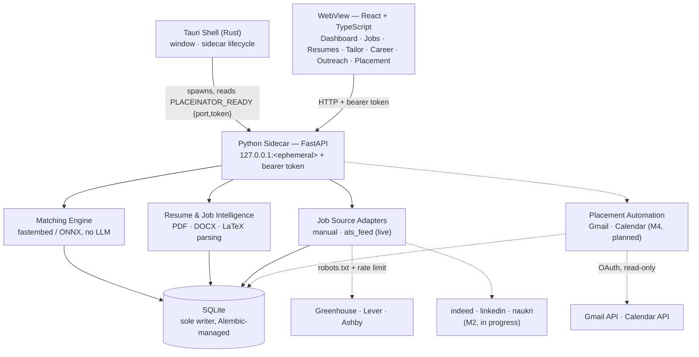

<h1 align="center">PlaceInator</h1>
<p align="center">A local-first placement assistant powered by an on-device ML matching engine: semantic resume↔job scoring, LaTeX resume tailoring, and Gmail→Calendar automation</p>
<h4 align="center">
    <a href="#install"><strong>Get started »</strong></a>
    <br />
    <br />
  <a href="docs/architecture.md">Architecture</a>
</h4>

<h4 align="center">
  
  <a href="https://github.com/SriramWorkSpace/PlaceInator/actions/workflows/ci.yml">
    
  </a>
  <a href="https://github.com/SriramWorkSpace/PlaceInator/commits/main">
    
  </a>
  
  
  <a href="https://github.com/SriramWorkSpace/PlaceInator">
    
  </a>
</h4>

The matching engine everything else in the app depends on is real ML — local
sentence embeddings scored against each other with cosine similarity, not a
prompt to a hosted model. It runs entirely on the user's machine: ONNX Runtime
for inference (never PyTorch — see
[ADR 0005](docs/decisions.md#adr-0005--fastembed--onnx-runtime-never-pytorch)),
SQLite for storage, and deliberately **no LLM anywhere in the pipeline** — see
[ADR 0002](docs/decisions.md#adr-0002--deterministic-engine-no-llm-generation)
for why every score is a reproducible number instead of a black box. Current
build status and full milestone history in
[the architecture doc](docs/architecture.md#milestone-status).

## How it works



Solid boxes and edges are built and tested; dashed ones are on the roadmap
([ADR 0003](docs/decisions.md#adr-0003--job-source-adapters-and-their-hard-boundary) covers why
LinkedIn/Naukri coverage will stay thin even once built). The sidecar prints exactly one
line to stdout on startup — `PLACEINATOR_READY {"port": 51234, "token": "..."}` — and
logs everything else to stderr, so that channel never carries anything but the handshake.

## The matching engine

The ML core (`placeinator/matching/`) is deterministic and explainable by
construction — every score is traceable back to the exact text that produced
it, not an opaque model call.

- **Model**: [`BAAI/bge-small-en-v1.5`](https://huggingface.co/BAAI/bge-small-en-v1.5)
  via [fastembed](https://github.com/qdrant/fastembed), a 384-dimension
  sentence-embedding model running on quantized ONNX weights (~64 MB,
  downloaded once and cached locally) — no network call per request, no
  PyTorch, no GPU required.
- **Chunking**: resumes are split into typed, source-tracked chunks
  (skills / projects / experience / summary); job descriptions into typed
  requirement lines. Every embedding is L2-normalized float32, stamped with
  the model name/dimension it was produced by, so a model upgrade leaves
  stale vectors detectable instead of silently wrong.
- **Scoring**: five independently-computed components, each in `[0, 1]`
  and each carrying its own top-k evidence pairs:

  | Component | Weight | Method |
  |---|---|---|
  | `skills` | 0.30 | Jaccard over a normalized skill taxonomy, blended with embedding similarity for terms outside it |
  | `overall` | 0.25 | Cosine similarity of mean-pooled resume vs. mean-pooled job description |
  | `projects` | 0.20 | Per requirement, max cosine over project bullets; mean of the top matches |
  | `experience` | 0.15 | Same shape over experience bullets, gated by years-of-experience fit |
  | `role` | 0.10 | Cosine of the job title against the resume's stated/target roles |

  The weighted sum is the match score shown throughout the app; the same
  per-component `MatchResult.explanation` record also drives job
  notifications, resume recommendations, and the tailoring change log — one
  computation, three UI features, always in agreement with each other.
- **Cached, not re-run**: a stored `MatchResult` is reused whenever neither
  the resume nor the job has changed since it was scored, and a rescore
  reuses the embeddings already on disk rather than re-embedding text —
  embedding is deterministic, so re-computing an unchanged vector would only
  spend CPU to reproduce the same numbers.

Full internals (chunk types, requirement kinds, the ranking-cache
invalidation rules) in
[the architecture doc's Matching Engine section](docs/architecture.md#the-matching-engine).

## Install

**Windows, no build tools needed:** grab an installer from
**[the latest release](https://github.com/SriramWorkSpace/PlaceInator/releases/latest)**
— double-click either file and follow the prompts. Windows SmartScreen may
warn about an unrecognized publisher (this isn't code-signed yet); click
"More info" → "Run anyway" to proceed.

| Installer | Notes |
|---|---|
| `PlaceInator_<version>_x64_en-US.msi` | Standard Windows Installer package. Can also install silently: `msiexec /i PlaceInator_<version>_x64_en-US.msi /qn`. |
| `PlaceInator_<version>_x64-setup.exe` | Self-contained NSIS setup wizard. |

Both install per-user (no admin rights required), add a Start Menu shortcut,
and register a standard Windows uninstaller. All app data — the SQLite
database, the cached embedding model, the downloaded Tectonic PDF compiler —
lives in a per-user AppData folder; nothing is written system-wide.

Building these yourself instead of downloading them: see
[Packaging](#packaging) below.

## Documentation

| Document | What it covers |
|---|---|
| [Architecture](docs/architecture.md) | System design, handshake protocol, module map, and milestone status (M0–M6) |
| [Changelog](docs/CHANGELOG.md) | What changed and when |
| [Decisions](docs/decisions.md) | ADRs recording the durable "why" |
| [Foundation audit](docs/audit-2026-08-19.md) | Nine defects found before development, in detail |

## Prerequisites

| Tool | Version | Required for |
|---|---|---|
| Python | 3.12+ (developed on 3.13) | sidecar |
| Node.js | 22+ (`.nvmrc` pins 22; Node 20 is end-of-life) | frontend |
| Rust + MSVC build tools | stable | Tauri shell |

PDF compile and scanned-document OCR need no separate install: PDF compile downloads
a self-contained [Tectonic](https://github.com/tectonic-typesetting/tectonic) binary on
first use (`placeinator/latex/compile.py`), and OCR uses
[RapidOCR](https://github.com/RapidAI/RapidOCR), a pure ONNX Runtime pipeline whose
models ship inside the `rapidocr-onnxruntime` pip package itself
(`placeinator/placement/ocr.py`). Neither requires MiKTeX/TeX Live or Tesseract.

## Setup

```bash
nvm use            # reads .nvmrc — Node 22
python -m venv .venv
.venv/Scripts/python.exe -m pip install -e ".[dev]"
npm install
```

CI pins both runtimes to exact versions (Python 3.13.7, Node 22). Matching them
locally is worth the minute it costs: a floating version is how a `robots.txt`
bug once passed on a dev machine and failed only in CI.

## Running

Without a Rust toolchain, run the two halves separately:

```bash
# Terminal 1 — sidecar. Note the port and token it prints.
.venv/Scripts/python.exe -m placeinator.main

# Terminal 2 — UI, pointed at that sidecar.
VITE_SIDECAR_PORT=<port> VITE_SIDECAR_TOKEN=<token> npm run dev
```

Once Rust is installed, `npm run tauri dev` launches both together.

## Packaging

Building the distributable installers freezes the sidecar first, then bundles
it into the Tauri shell:

```bash
cd packaging
../.venv/Scripts/python.exe -m PyInstaller placeinator_backend.spec --noconfirm
cd ..
npm run build
npx tauri build
```

Outputs land in `src-tauri/target/release/bundle/msi/` and
`src-tauri/target/release/bundle/nsis/` — see [Install](#install) above for
what to do with them.

## Checks

```bash
.venv/Scripts/python.exe -m pytest tests/            # "-m live"/"-m model" opt into network/model tests
.venv/Scripts/python.exe -m ruff check placeinator tests migrations
.venv/Scripts/python.exe -m mypy placeinator
npm run typecheck && npm run lint && npm run build && npm audit
```

## Layout

```
placeinator/      Python sidecar — flat feature packages, one per spec section
  api/ db/        HTTP layer and data layer
  matching/       the scoring engine everything depends on
  jobs/sources/   pluggable job-discovery adapters (ADR 0003)
  skills/         taxonomy — the semantic backbone, since there is no LLM
migrations/       Alembic; the only thing that creates or alters schema
src/              React frontend (routes/, components/, lib/, styles/)
src-tauri/        Rust shell — sidecar supervision, window/tray, and packaging (PyInstaller + MSI/NSIS via `tauri build`)
tests/            unit/ (in-process) · integration/ (real I/O) · fixtures/ (golden files)
docs/             specification, architecture, roadmap, changelog, decisions
```

## Database

SQLite in the per-user data directory, owned exclusively by the Python side.
**Alembic is the only thing that creates or alters schema** — never call `create_all`
in application code. After changing a model:

```bash
.venv/Scripts/python.exe -m alembic revision --autogenerate -m "what changed"
.venv/Scripts/python.exe -m alembic check      # asserts models and migrations agree
```

Migrations run automatically on sidecar startup. `Base.metadata` carries a constraint
naming convention because SQLite requires Alembic's batch mode for most alterations,
and batch mode can only recreate constraints it can name — see
[ADR 0004](docs/decisions.md#adr-0004--alembic-is-the-sole-owner-of-database-schema).
