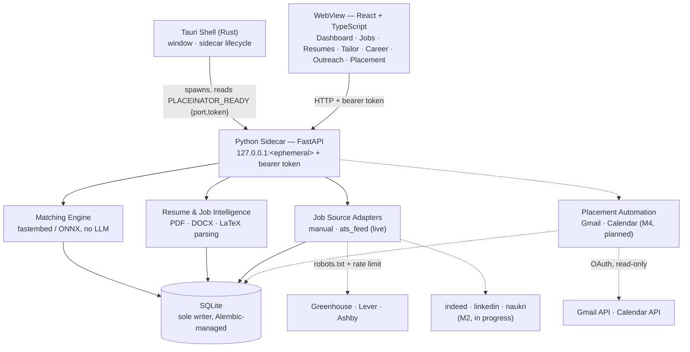

<h1 align="center">PlaceInator</h1>
<p align="center">A local-first placement assistant: resume↔job matching, LaTeX resume tailoring, and Gmail→Calendar automation</p>
<h4 align="center">
    <a href="#setup"><strong>Get started »</strong></a>
    <br />
    <br />
  <a href="docs/architecture.md">Architecture</a> |
  <a href="docs/specification.md">Specification</a> |
  <a href="docs/roadmap.md">Roadmap</a>
</h4>

<h4 align="center">
  
  <a href="https://github.com/SriramWorkSpace/PlaceInator/actions/workflows/ci.yml">
    
  </a>
  <a href="https://github.com/SriramWorkSpace/PlaceInator/commits/main">
    
  </a>
  
  <a href="https://github.com/SriramWorkSpace/PlaceInator">
    
  </a>
</h4>

Runs entirely on the user's machine: SQLite for storage, ONNX Runtime for embeddings
(never PyTorch — see [ADR 0005](docs/decisions.md#adr-0005--fastembed--onnx-runtime-never-pytorch)),
no LLM anywhere in the pipeline (see [ADR 0002](docs/decisions.md#adr-0002--deterministic-engine-no-llm-generation)).
Full feature list in [the specification](docs/specification.md); current build status in
[the roadmap](docs/roadmap.md).

## How it works



Solid boxes and edges are built and tested; dashed ones are on the roadmap
([ADR 0003](docs/decisions.md#adr-0003--job-source-adapters-and-their-hard-boundary) covers why
LinkedIn/Naukri coverage will stay thin even once built). The sidecar prints exactly one
line to stdout on startup — `PLACEINATOR_READY {"port": 51234, "token": "..."}` — and
logs everything else to stderr, so that channel never carries anything but the handshake.

## Documentation

| Document | What it covers |
|---|---|
| [Specification](docs/specification.md) | Feature requirements — the source of truth |
| [Architecture](docs/architecture.md) | System design, handshake protocol, module map |
| [Roadmap](docs/roadmap.md) | Milestones M0–M6 |
| [Changelog](docs/CHANGELOG.md) | What changed and when |
| [Decisions](docs/decisions.md) | ADRs recording the durable "why" |
| [Foundation audit](docs/audit-2026-08-19.md) | Nine defects found before development, in detail |

## Prerequisites

| Tool | Version | Required for |
|---|---|---|
| Python | 3.12+ (developed on 3.13) | sidecar |
| Node.js | 22+ (`.nvmrc` pins 22; Node 20 is end-of-life) | frontend |
| Rust + MSVC build tools | stable | Tauri shell — **not yet installed** |
| MiKTeX or TeX Live | any | optional PDF compile only |
| Tesseract OCR | any | optional scanned-document support only |

The last three are optional in the strict sense that the app must detect their absence
and degrade with an explanation rather than erroring.

## Setup

```bash
nvm use            # reads .nvmrc — Node 22
python -m venv .venv
.venv/Scripts/python.exe -m pip install -e ".[dev]"
npm install
```

CI pins both runtimes to exact versions (Python 3.13.7, Node 22). Matching them
locally is worth the minute it costs: a floating version is how a `robots.txt`
bug once passed on a dev machine and failed only in CI.

## Running

Without a Rust toolchain, run the two halves separately:

```bash
# Terminal 1 — sidecar. Note the port and token it prints.
.venv/Scripts/python.exe -m placeinator.main

# Terminal 2 — UI, pointed at that sidecar.
VITE_SIDECAR_PORT=<port> VITE_SIDECAR_TOKEN=<token> npm run dev
```

Once Rust is installed, `npm run tauri dev` launches both together.

## Checks

```bash
.venv/Scripts/python.exe -m pytest tests/            # "-m live"/"-m model" opt into network/model tests
.venv/Scripts/python.exe -m ruff check placeinator tests migrations
.venv/Scripts/python.exe -m mypy placeinator
npm run typecheck && npm run lint && npm run build && npm audit
```

## Layout

```
placeinator/      Python sidecar — flat feature packages, one per spec section
  api/ db/        HTTP layer and data layer
  matching/       the scoring engine everything depends on
  jobs/sources/   pluggable job-discovery adapters (ADR 0003)
  skills/         taxonomy — the semantic backbone, since there is no LLM
migrations/       Alembic; the only thing that creates or alters schema
src/              React frontend (routes/, components/, lib/, styles/)
src-tauri/        Rust shell — blocked on the Rust toolchain
tests/            unit/ (in-process) · integration/ (real I/O) · fixtures/ (golden files)
docs/             specification, architecture, roadmap, changelog, decisions
```

## Database

SQLite in the per-user data directory, owned exclusively by the Python side.
**Alembic is the only thing that creates or alters schema** — never call `create_all`
in application code. After changing a model:

```bash
.venv/Scripts/python.exe -m alembic revision --autogenerate -m "what changed"
.venv/Scripts/python.exe -m alembic check      # asserts models and migrations agree
```

Migrations run automatically on sidecar startup. `Base.metadata` carries a constraint
naming convention because SQLite requires Alembic's batch mode for most alterations,
and batch mode can only recreate constraints it can name — see
[ADR 0004](docs/decisions.md#adr-0004--alembic-is-the-sole-owner-of-database-schema).
